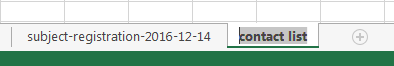

# LLRN Recruitment
## Operating Procedure

### Recruitment Criteria & Accessing the Dashboard
1. Decide on your recruitment criteria: Age, sex, race, locations, etc.
2. Log in to the WordPress admin dashboard.
  1. Navigate to https://sciences.ucf.edu/psychology/llrn/wp-admin/
  2. Sign in with NID & NID password

### Export Registration Data
1. On the left sidebar, navigate to:
  - `Forms` -> `Import/Export`
2. Select Form: "Subject Registration"
3. Export as CSV file:
  1. Select Fields: "Select All"
    - You will most likely not use all these fields, but it is easier to just export them all and filter them out later.
  2. You can apply conditional logic to filter for your recruitment criteria if you wish. It is generally easier to do so in Excel (see below)
  3. The "Date Range" filter only serves to filter out subject entries based on the date they were created. It is suggested to leave it blank.
  4. Click: `Download Export File`
4. Open CSV export file in Excel and save it as an Excel Workbook.
  - Filters and sorting will not save with your export if you keep it as a CSV file.
  - `File` -> `Save As` -> `location` -> `Save as type: Excel Workbook`
  
  

### Create Contact List
1. Create a new worksheet in the Excel workbook, and call it "Contact List"

  
  
2. Go back to the original worksheet and apply your filters:
  1. Highlight entire worksheet with Ctrl+A
  2. `Data` -> `Filter`
  3. Select your criteria, filter and sort columns to determine who you will contact
  4. **Be sure** to check when each subject was last contacted, by filtering the first several columns, against their preference for contact frequency ("*How often would you like to be contacted by us?*")
    - i.e., if their preference isto be contacted no more often than once a month, do not contact them if they have been contacted within the month.
9.	Once filters and sorts are applied, copy and paste the remaining subjects’ information into your “Contact list” worksheet.
a.	If you have a lot to deal with, it can be useful to add these in batches, based on separate filters.

### Contact subjects from your contact list
10.	Contact subjects from your contact list
a.	When the list is complete, Sort the contact list by preferred contact window and contact subjects within their preferred contact window.
i.	Morning (6 AM – 10 AM), Mid-day (10 AM – 2 PM),					 Afternoon (2 PM – 6 PM), Evening (6 PM – 10 PM)
b.	As you move down the contact list, log the result of each contact and any notes for yourself or the database.
c.	Contact subjects in batches, based on the time you have available or based on the contact windows.
d.	When a batch of subjects has been contacted and the result of each contact logged in your worksheet, return to the Wordpress admin dashboard and update each contact’s entry in the Subject Registration form.
i.	On the left sidebar: “Forms” -> “Entries”. Make sure Subject Registration is the active form in the top left.
ii.	Search for each contact by last name and select “View” to open their entry in a new tab.  
iii.	On each entry page, select the “Edit” button on the right sidebar. 

-	Add a new line to the contact log for each subject with the date, your name, the project title, and the result of your contact. Also add any notes to the “Relevant notes” field, with the date and your name.  
-	When finished updating a subject entry, select “Update” button on the right sidebar. 
 

 
1.	rules for using the database 
o	following frequency and method of contact preference
o	attention to research location preference
o	respect for participant privacy (e.g., do not keep paper or electronic copies of database participants in the lab)
o	**exactly procedure for logging and updating contact history**
o	short script for emails and calls (need to develop this for general use)
2.	how to log in
3.	how to search for participants (including database download instructions -- and explicitly state that any downloaded copies of the database should be destroyed at the end of each recruitment session)

